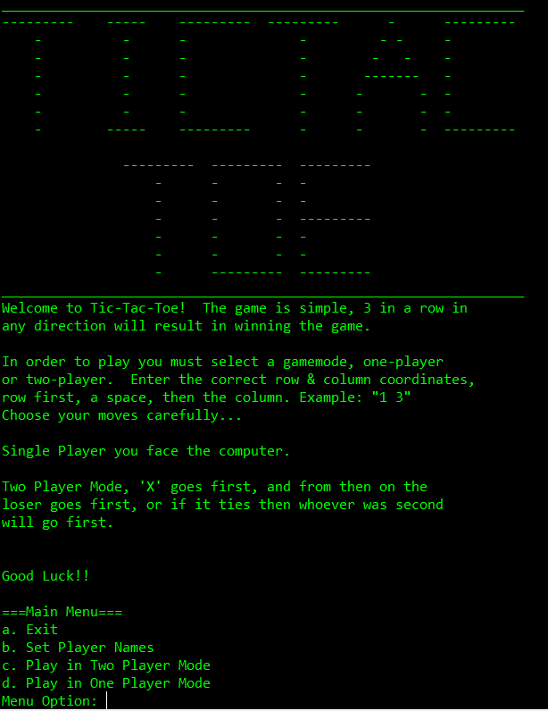
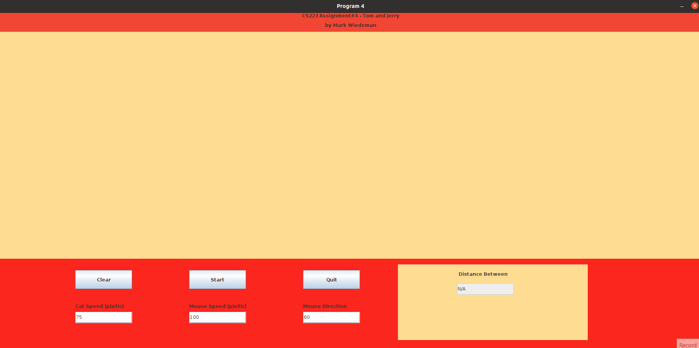
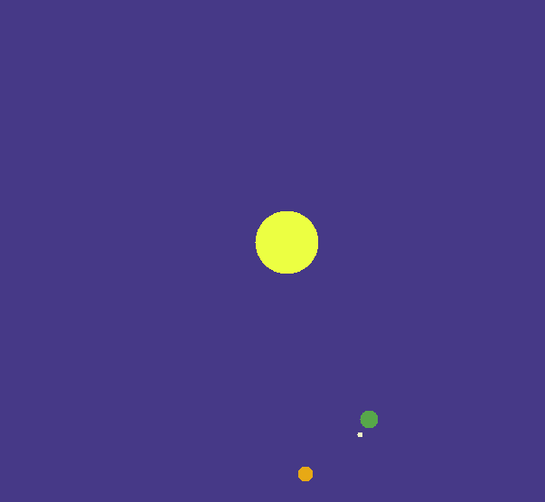

## Welcome to my Portfolio

Hello, I am **Mark Wiedeman**, and this is a simple website to archive some of my git repos containing past projects.  I'm have a Bachelor's in Computer Science from CSUF and have been coding for approximately 6 years.  I have had experience with C++, C#, Java, Javascript, Python, SQL, and other languages.  

I've chosen these projects to best represent me and how I write code.  As for the projects here: The **Tic-Tac-Toe** is a demonstration of my function use and algorithms, the **Tom and Jerry** project shows my ability to navigate graphical components of Java, and then the **Solar System** project is simply for fun.  **Feel free to visit any of the git repos from this page as they each have git repos with pages, which more greatly describe and show the programs.**

### Eros

&nbsp;&nbsp;&nbsp;&nbsp;&nbsp;&nbsp;&nbsp;&nbsp;This project was a challenging one due to the strict timeframe the team had to stick to.  The MVP was to make a metroidvania style game within a month's time.  We used unity as the editor, so the majority of the work was done in C#.  The large majority of the assets were made from scratch.  Our team consisted of the following members. UI/UX designer - <a href="https://www.linkedin.com/in/brynnlee-ehrsam">Brynnlee Ehrsam</a>
 , Gameplay Developers - <a href="https://www.linkedin.com/in/mateo-rodriguez-reyes">Mateo Rodriguez</a> and <a href="https://www.linkedin.com/in/mark-wiedeman-47bb45213">Mark Wiedeman</a>, and Interface Developer - <a href="https://www.linkedin.com/in/quin-stankus-84b94618a">Quinlan Stankus</a>
.  This project taught me how important it is to manage time wisely when your team is in a time crunch.  We are currently working on another project that we plan to release within the year.

**Check out this project here:** [Eros Project](https://erosproject.itch.io/eros)

### Tic-Tac-Toe

&nbsp;&nbsp;&nbsp;&nbsp;&nbsp;&nbsp;&nbsp;&nbsp;This is one of my earlier programs, it offers a few simple functions such as single player, two player, and switching the names of the players via the console.  Playing the game itself is also relatively simple as it is done by entering the space you would like the 'X' or 'O' to go respectively, depending on which player you are. 
 &nbsp;&nbsp;&nbsp;&nbsp;&nbsp;&nbsp;&nbsp;&nbsp;The single player uses an AI based on the minimax algorithm.  Throughout the program there are many prompts and descriptions for how it is meant to work in order to guide the player through the console based environment.  Basic ASCII art is used for winnning and losing screens as well.

**Check out this project here:** [Tic-Tac-Toe by: Mark Wiedeman](https://github.com/marklanglo/TicTacToe/tree/main)

### Tom and Jerry

&nbsp;&nbsp;&nbsp;&nbsp;&nbsp;&nbsp;&nbsp;&nbsp;This is a java graphical program that has two dots moving across the screen, the brownish dot is Jerry(Mouse) and the Greyish dot is Tom(Cat).  The user inputs the speed that both will move at, and then they enter the angle at which Jerry will bounce off the walls.  The program is essentially one dot that bounces off of the walls and the other pathfinds to the ball that is bouncing around until it catches it.
 &nbsp;&nbsp;&nbsp;&nbsp;&nbsp;&nbsp;&nbsp;&nbsp;For coding style, this program demostrates how extensive I can be when it comes to commenting.  Each process is detailed to the extent needed to understand the project for anyone with a basic programming background.

**Check out this project here:** [Tom and Jerry by: Mark Wiedeman](https://github.com/marklanglo/Tom-and-Jerry)

### Solar System

        
&nbsp;&nbsp;&nbsp;&nbsp;&nbsp;&nbsp;&nbsp;&nbsp;This is more of a fun project which is simply a demonstration of basic java graphics.  The program calculates the rate at which earth, mars, and the moon are meant to spin based on the inputted speed by the user.  It is dynamically calculating position around the center "Sun" rather than moving on a set path.

**Check out this project here:** [Solar System by: Mark Wiedeman](https://github.com/marklanglo/Solar-System)

### Thank You For Visiting My Portfolio

Thank you for taking the time to consider my portfolio, if you wish to contact me please do so via email: "marklwiedeman@gmail.com".

You can also view my [LinkedIn here.](https://www.linkedin.com/in/mark-wiedeman-47bb45213/)
